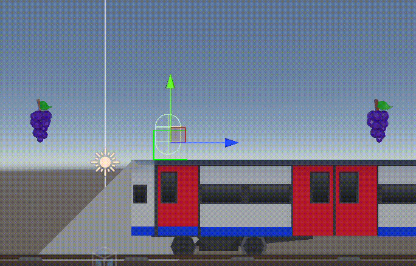
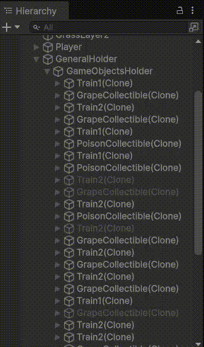

# Dự Án Cá Nhân Cho Khóa Học Junior Programmer - Tail Rush

Một tựa game endless runner được xây dựng bằng Unity. Người chơi điều khiển nhân vật cáo chạy dọc theo các đường ray song song, thu thập những trái nho để phục hồi máu và né tránh độc tố cũng như các đoàn tàu đang lao tới. Trò chơi sẽ =tăng tốc theo thời gian, thử thách người chơi sống sót lâu nhất có thể.

## Những Điều Tôi Đã Học

### [Lab 1 - Start Your Personal Project](https://learn.unity.com/pathway/junior-programmer/unit/getting-started-1/tutorial/lab-1-start-your-personal-project?version=6.3)

**Tiến độ mới**

- **Tạo Tài liệu Thiết kế Game (GDD):** Ghi chép tài liệu ngắn gọn về thiết kế, cơ chế, và mục tiêu của dự án. Xem tại [Tài liệu Thiết kế Game Tail Rush](https://docs.google.com/document/d/1EVPopBPAVQPoHID1BOLbACJpeHnu7KlxIryFtXTH3OM/edit?tab=t.0#heading=h.ic97nye8eswm).

**Khái niệm & kỹ năng mới**

- **Lập kế hoạch thiết kế game:** Học cách phác thảo các cơ chế game, vòng lặp gameplay và các thông số điều khiển trước khi bắt đầu lập trình.

### [Lab 2 - New Project with Primitives](https://learn.unity.com/pathway/junior-programmer/unit/basic-gameplay/tutorial/lab-2-new-project-with-primitives?version=6.3)

**Tiến độ mới**

- **Tạo dự án mới:** Khởi tạo một dự án Unity mới từ Unity Hub.
- **Đặt vị trí và xoay Camera dựa trên thể loại game:** Thiết lập camera theo dõi từ góc nhìn thứ ba đặt phía sau nhân vật.
- **Tất cả các đối tượng chính trong màn chơi đều có Material riêng:** Mỗi thành phần trong project đều được gán một Material với màu khác nhau để phân biệt.

**Khái niệm & kỹ năng mới**

- **Hình khối cơ bản (Primitives):** Dùng các khối cơ bản của Unity (Cube, Sphere, Cylinder, ...) để thay thế tạm thời cho model nhân vật, đường ray, vật phẩm, ...
- **Tạo vật liệu mới:** Tạo các material khác nhau trong Project Tab và kéo thả vào object của từng loại đối tượng trong scene.
- **Xuất gói Unity (Export Package):** Ghi lại tài liệu các phiên bản dự án và học cách xuất các cập nhật dưới dạng gói Assets để sao lưu dự án.

### [Lab 3 - Player Control](https://learn.unity.com/pathway/junior-programmer/unit/sound-and-effects/tutorial/lab-3-player-control?version=6.3)

**Tiến độ mới**

- **Người chơi có thể di chuyển dựa trên input từ Player:** Tích hợp Input System mới thông qua các Action map trong [PlayerController.cs](Assets/Scripts/Player/PlayerController.cs) để xử lý chuyển làn, Nhảy và Tiếp đất nhanh.
- **Di chuyển của người chơi được giới hạn:** Người chơi chỉ di chuyển theo chiều ngang trên làn cố định, được tính toán động.

**Khái niệm & kỹ năng mới**

- **Lập trình C#:** Lên kế hoạch và triển khai script [PlayerController.cs](Assets/Scripts/Player/PlayerController.cs) để di chuyển người chơi, sử dụng Coroutine và thuật toán tính vị trí.
- **Tự giải quyết và sửa lỗi:** Khắc phục các vấn đề overlap giữa người chơi và tàu hỏa bằng cách tự tạo script [CustomPhysics.cs](Assets/Scripts/Player/CustomPhysics.cs) thay cho Rigidbody 3D của Unity.

### [Lab 4 - Basic Gameplay](https://learn.unity.com/pathway/junior-programmer/unit/gameplay-mechanics/tutorial/lab-4-basic-gameplay?version=6.3)

**Tính năng mới**

- **Các prefab không phải Player có những di chuyển cơ bản:** Triển khai [MovingObject.cs](Assets/Scripts/Objects/MovingObject.cs) để di chuyển các vật thể về phía người chơi (Tạo cảm giác người chơi di chuyển liên tục).
- **Các đối tượng được tắt đi khi rời khỏi màn hình:** Tái chế các vật thể đã đi khuất màn hình về Pool Manager.
- **Va chạm giữa các đối tượng được xử lý phù hợp:** Xử lý các Trigger thông qua Interface như `IDamageable` và `IHittable` để trừ máu người chơi và tạo lực đẩy dội ngược sang hai bên khi va chạm.
- **Các đối tượng được sinh ra tại các vị trí thích hợp theo khoảng thời gian định sẵn:** Tạo đối tượng [LevelSpawner.cs](Assets/Scripts/Managers/LevelSpawner.cs) để sinh ngẫu nhiên tàu hỏa và vật phẩm thu thập trên khắp các làn ray đang hoạt động.

**Khái niệm & kỹ năng mới**

- **Tự phát triển lối chơi cơ bản:** Tổ chức các hành vi độc lập cho các chướng ngại vật và vật phẩm thu thập, kế thừa từ [Collectible.cs](Assets/Scripts/Objects/Collectibles/Collectible.cs) cho các phản ứng riêng biệt của nho và chất độc.

### [Lab 5 - Swap Out Your Assets](https://learn.unity.com/pathway/junior-programmer/unit/user-interface/tutorial/lab-5-swap-out-your-assets?version=6.3)

**Tính năng mới**

- **Thay thế hình ảnh khối thô sơ mà không cần viết lại mã nguồn:** Thay thế các khối tạm thời bằng các mô hình 3D (tàu hỏa, mô hình nhân vật, ...).
- **Cập nhật hình ảnh môi trường:** Thiết lập material mới cho các vật thể môi trường, các hoạt ảnh chạy của nhân vật và hiệu ứng khi thu thập vật phẩm.
- **Cập nhật phông chữ UI:** Thay thế các phông chữ mặc định bằng các phông chữ phù hợp với theme của game.

**Khái niệm & kỹ năng mới**

- **Quy trình làm việc với tài nguyên mỹ thuật:** Nhập (import), duyệt tìm và áp dụng các gói tài nguyên từ bên thứ ba vào môi trường dự án cục bộ.
- **Prefab lồng nhau (Nested Prefabs):** Các prefab có thể được tái sử dụng làm object con của prefab khác.

### Các Tính Năng Mở Rộng

- **Mô hình kiến trúc UI MVP (Model-View-Presenter):** Tách biệt trạng thái logic của trò chơi ra khỏi các thành phần hiển thị giao diện. [CollectedGrapePresenter.cs](Assets/Scripts/MVP/Presenters/CollectedGrapePresenter.cs) giám sát các thay đổi dữ liệu bên trong [GameData.cs](Assets/Scripts/ScriptableObjects/GameData.cs) và cập nhật hiển thị tương ứng sang [CollectedGrapeView.cs](Assets/Scripts/MVP/Views/Ingame/CollectedGrapeView.cs).

- **Hệ thống Vật lý Tùy chỉnh:** Lập trình tính toán phát hiện mặt đất, bù trừ vị trí áp sát mặt đất và áp dụng lực trọng trường tùy chỉnh trong [CustomPhysics.cs](Assets/Scripts/Player/CustomPhysics.cs) mà không phụ thuộc vào Rigidbody 3D mặc định của Unity.




- **Lặp lại (Infinite Repetition):** Xây dựng một hệ thống lặp lại hình ảnh dựa trên trục tọa độ trong [AutoRepeat.cs](Assets/Scripts/Objects/AutoRepeat.cs) để tự động nối tiếp các mảnh bản đồ/môi trường dựa trên kích thước mesh.


- **Kiến trúc ScriptableObject:** Lưu trữ các tùy chỉnh hệ thống như bật/tắt nhạc nền và âm thanh hiệu ứng bên trong [SettingsData.cs](Assets/Scripts/ScriptableObjects/SettingsData.cs), tự động lưu trữ trạng thái người chơi bằng `PlayerPrefs`.

- **Hệ thống Object Pooling:** Xây dựng một hệ thống pooling linh hoạt [PoolManager.cs](Assets/Scripts/Managers/PoolManager.cs) hỗ trợ tạo sẵn và tái sử dụng các hiệu ứng hạt, chướng ngại vật và các văn bản UI chỉ số nổi nhảy số ([IncrementText.cs](Assets/Scripts/UI/IncrementText.cs)).



- **Các thành phần UI tương tác mượt mà:** Tạo ra các lớp nút bấm tùy chỉnh [CustomButton.cs](Assets/Scripts/UI/CustomButton.cs) và [CustomToggle.cs](Assets/Scripts/UI/CustomToggle.cs) hỗ trợ độ trễ khi nhấp chuột (tránh nhấn liên tục) và thay đổi hình ảnh nút tương ứng với trạng thái bật/tắt.


## Cấu Trúc Thư Mục Dự Án

```text
Personal Project/
|-- Assets/
|   |-- Animations/
|   |-- Audios/
|   |-- Fonts/
|   |-- Materials/
|   |-- Models/
|   |-- Prefabs/
|   |   |-- Background/
|   |   |-- Characters/
|   |   |-- Collectibles/
|   |   |-- Trains/
|   |   `-- UI/
|   |-- Scenes/
|   |   |-- MainMenu.unity
|   |   `-- Gameplay.unity
|   |-- Settings/
|   |-- Sprites/
|   |-- TextMesh Pro/
|   `-- Scripts/
|       |-- Camera/
|       |   |-- FollowTarget.cs
|       |   `-- LookAtCamera.cs
|       |-- Events/
|       |   |-- GameEvents.cs
|       |   |-- PlayerEvents.cs
|       |   `-- UIEvents.cs
|       |-- MVP/
|       |   |-- Presenters/
|       |   |   |-- CollectedGrapePresenter.cs
|       |   |   `-- SettingsPanelPresenter.cs
|       |   `-- Views/
|       |       |-- Ingame/
|       |       |   |-- CollectedGrapeView.cs
|       |       |   |-- GameplayView.cs
|       |       |   |-- PauseMenuButtonsView.cs
|       |       |   `-- PauseMenuView.cs
|       |       |-- MainMenu/
|       |       `-- SettingsPanelView.cs
|       |-- Managers/
|       |   |-- AudioManager.cs
|       |   |-- GameManager.cs
|       |   |-- LevelSpawner.cs
|       |   |-- PoolManager.cs
|       |   `-- SceneLoader.cs
|       |-- Objects/
|       |   |-- Collectibles/
|       |   |   |-- Collectible.cs
|       |   |   |-- GrapeCollectible.cs
|       |   |   `-- PoisonCollectible.cs
|       |   |-- AutoRepeat.cs
|       |   |-- Deadbox.cs
|       |   |-- FloatingObject.cs
|       |   |-- Hitbox.cs
|       |   |-- IPoolObject.cs
|       |   |-- MovingObject.cs
|       |   |-- MovingObjectsDespawnZone.cs
|       |   |-- PooledParticle.cs
|       |   `-- Train.cs
|       |-- Player/
|       |   |-- CollectiblesDetector.cs
|       |   |-- CustomPhysics.cs
|       |   |-- IDamageable.cs
|       |   |-- IHealable.cs
|       |   |-- IHittable.cs
|       |   |-- PlayerController.cs
|       |   `-- PlayerHealth.cs
|       `-- UI/
|           |-- CustomButton.cs
|           |-- CustomToggle.cs
|           |-- IncrementText.cs
|           |-- IngameUI.cs
|           `-- MainMenuUI.cs
|-- Packages/
`-- ProjectSettings/
```
## Screenshot

## Video Demo

## Link Sản Phẩm Game

[Trải nghiệm Tail Rush trên Itch.io](https://nguyenthanhvu.itch.io/tail-rush)

## Cách Chạy Dự Án Trên Local

1. Mở dự án bằng phiên bản Unity Editor (Tương thích với Unity 6 / Unity 6000+).
2. Mở scene `Assets/Scenes/MainMenu.unity`.
3. Nhấn nút **Play** trong editor.
4. Nhấn nút Play trên giao diện UI để bắt đầu chơi. Sử dụng các phím mũi tên Trái/Phải (hoặc các phím được thiết lập trong `InputSystem_Actions`) để chuyển làn chạy, phím Nhảy (Jump) và phím Tiếp đất nhanh (Drop).
